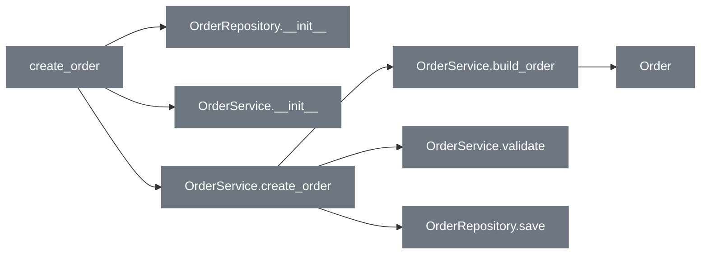
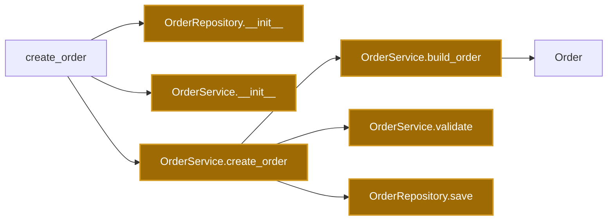
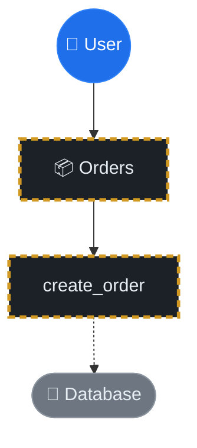
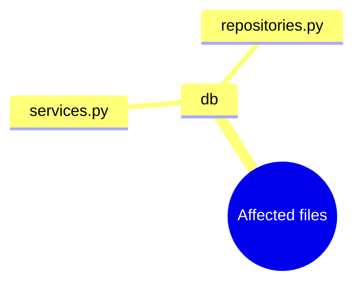
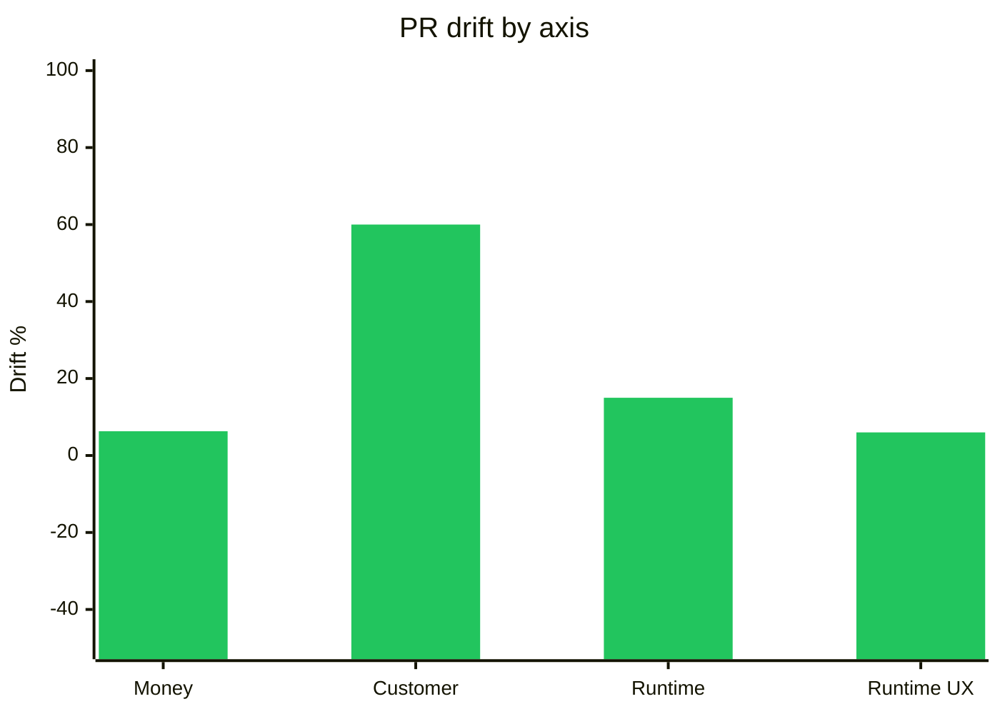
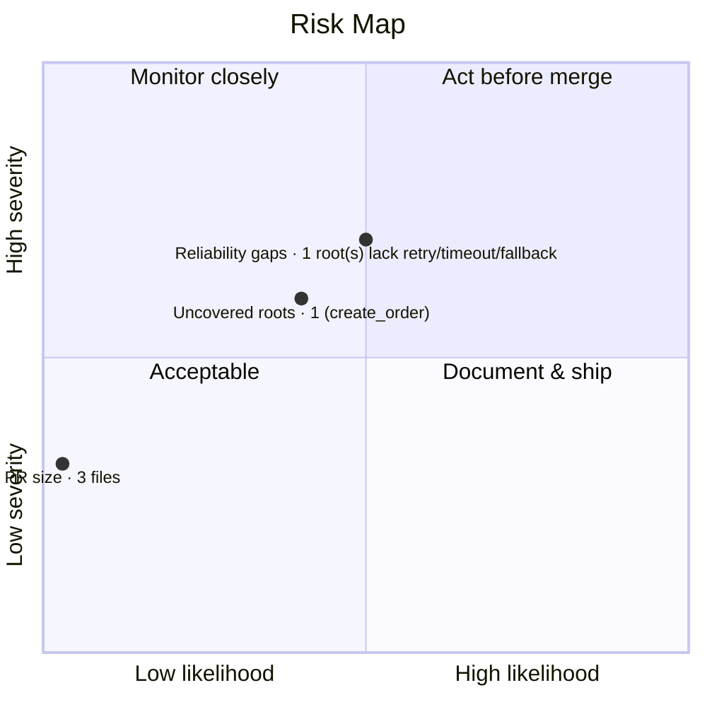

<!-- drift:sticky-comment -->
<p align="center"><a href="https://refactorlab.github.io/andy/"></a></p>

<p></p>
<p></p>

## Drift review — `Drift smoke run`

> 🟢 **Looks good** — add tests and drop 3 dead exports before you ship.

> <sub>🛡️ **Merge confidence 4/5** (minor polish) &nbsp;·&nbsp; 🧮 **Review effort 1/5** · ≈ 5 min</sub>

<sub>📍 [`PLACEHOLDER_OWNER/PLACEHOLDER_REPO`](https://github.com/PLACEHOLDER_OWNER/PLACEHOLDER_REPO) &nbsp;·&nbsp; sticky review comment — re-rendered on every push &nbsp;·&nbsp; advisory check</sub>

> [!TIP]
> **TL;DR —** Overall drift **+21.8%** — a net improvement. Underneath: **+54 LOC** shipped with **0** tests. _Advisory — does not fail the check._
>
> 👉 **Look here first:** **1** entry point lacks retry / timeout / fallback or test coverage

 &nbsp; &nbsp; &nbsp; &nbsp; &nbsp; &nbsp; &nbsp; &nbsp; &nbsp;

### ✅ Before you merge

- [ ] Add tests — **+54** LOC landed with **0** new test files
- [ ] Remove or wire up 3 dead exports: [`db.py`](https://github.com/PLACEHOLDER_OWNER/PLACEHOLDER_REPO/blob/deadbeefcafe1234567890abcdef0123456789ab/drift-static-profiler/tests/fixtures/python-fastapi/app/db.py#L1), [`get_session`](https://github.com/PLACEHOLDER_OWNER/PLACEHOLDER_REPO/blob/deadbeefcafe1234567890abcdef0123456789ab/drift-static-profiler/tests/fixtures/python-fastapi/app/db.py#L8), [`OrderRepository::find_by_id`](https://github.com/PLACEHOLDER_OWNER/PLACEHOLDER_REPO/blob/deadbeefcafe1234567890abcdef0123456789ab/drift-static-profiler/tests/fixtures/python-fastapi/app/repositories.py#L14)
- [ ] Decide on retry / timeout / fallback for the 1 uncovered entry point

> **Merge readiness** &nbsp; `░░░░░░░░░░` &nbsp; **0 / 3** — GitHub tallies the boxes above as you check them off.

<details>
<summary> — Before vs after diagrams · 1 unreachable</summary>

> **1 changed file is unreachable** from any entry point — likely dead code, config, or tests: [`db.py`](https://github.com/PLACEHOLDER_OWNER/PLACEHOLDER_REPO/blob/deadbeefcafe1234567890abcdef0123456789ab/app/db.py). (These match the dead-code suggestions below.)

<details>
<summary>🧭 Architecture flow diagram — before vs after</summary>

> **🔴 BEFORE** reconstructs the call graph as it existed pre-PR (`status=added` files skipped, `status=removed` files appear as red placeholder cards). **🟢 AFTER** shows the current call graph with file-status colouring (🟩 added, 🟧 modified/renamed).
> Nodes labelled `‹anonymous@N›` are anonymous functions/callbacks the profiler could not name; treat them as call sites within their module.

**🔴 BEFORE — what the code was:**



**🟢 AFTER — what the code is now:**



[Mermaid flowchart reference](https://mermaid.js.org/syntax/flowchart.html)

</details>

<details>
<summary>🧠 Business-logic reach diagram</summary>

> **Summary —** feat(orders): introduce OrderService layer — Splits order creation into a dedicated service.



</details>

<details>
<summary>📦 Data structures touched (2)</summary>

| Name | Kind | Language | Methods in scope |
|---|:--:|---|---:|
| `OrderService` | modified | python | 4 |
| `OrderRepository` | modified | python | 2 |

</details>

<details>
<summary>🗂 Key files — hot-touch mindmap</summary>



</details>

</details>

<details open>
<summary> — Overall drift +21.8% ▲ · 👥 Customer / user value leads</summary>

<table>
<caption>PR value drift — composite &amp; per-axis (Δ% vs. base)</caption>
<tr>
<td colspan="4" align="center"><strong>Composite&nbsp; 🟢 +21.8%</strong> &nbsp;<code>███▋░░░░░░</code>&nbsp; <sub>mean of the 4 axes — <strong>improved</strong></sub></td>
</tr>
<tr><th align="center" width="25%" scope="col">💰 Money</th><th align="center" width="25%" scope="col">👥 Customer / user value</th><th align="center" width="25%" scope="col">⚙️ Software runtime</th><th align="center" width="25%" scope="col">🎨 Software runtime UX</th></tr>
<tr><td align="center"><strong>🟢 +6.3%</strong><br><sub>improved</sub></td><td align="center"><strong>🟢 +60.0%</strong><br><sub>improved</sub></td><td align="center"><strong>🟢 +15.0%</strong><br><sub>improved</sub></td><td align="center"><strong>🟢 +6.0%</strong><br><sub>improved</sub></td></tr>
<tr><td align="center"><code>█░░░░░░░░░</code></td><td align="center"><code>██████████</code></td><td align="center"><code>██▌░░░░░░░</code></td><td align="center"><code>█░░░░░░░░░</code></td></tr>
<tr><td align="center"><sub>confidence&nbsp;·&nbsp;<code>high</code></sub></td><td align="center"><sub>confidence&nbsp;·&nbsp;<code>high</code></sub></td><td align="center"><sub>confidence&nbsp;·&nbsp;<code>low</code></sub></td><td align="center"><sub>confidence&nbsp;·&nbsp;<code>low</code></sub></td></tr>
</table>

<sub>Bars show |Δ| relative to the largest axis (customer, 60.0%), ⅛-block precision. 🔴 regression · 🟢 improvement · ⚪ flat.</sub>

> 🔁 **Since last review** &nbsp; _First run on this PR — no prior snapshot to diff. Each later push re-renders this sticky comment and fills this line with per-axis deltas (e.g. 💰 ▲ +2.1pp · ⚙️ ▼ −1.0pp)._

> **Bottom line —** all 4 axes trend positive. Strongest: 👥 Customer / user value at +60.0%. Projected $ savings clear the dev-hours invested within ~9 weeks of merge.

**Highlights:** ✨ **1** new features &nbsp;·&nbsp; 🐛 **2** bug fixes &nbsp;·&nbsp; 📋 **1** issues resolved &nbsp;·&nbsp; 🧪 **0** new test files

<details>
<summary>📐 How each axis was computed — expand an axis</summary>

<details>
<summary>💰 Money · <code>+6.3%</code> · confidence <code>high</code></summary>

*Tech-debt servicing: bugs + maintenance + AI tokens*

```
Δ% = (projected_savings − cost) / (160h × $95) × 100. cost = human_debt (bug_hours[Critical 8 / Important 3 / Minor 0.5] + maintenance [1.5h/finding + 0.01h/LOC]) × $95 + LLM_iteration_cost (6 iters × ~1M tokens × size × debt-multiplier × $5/1M) + infra/db uplift. NEW-feature dev-time is NOT modeled — this axis is the cost of SERVICING what the PR ships.
```

- Tech-debt invested: **-$169**
- ↳ Maintenance debt: **-$51 (0.5h)**
- ↳ LLM iteration cost: **-$48 (~9.6M tokens)**
- ↳ Infra / DB monthly: **-$70**
- Projected savings: **+$1126**

**Source:** [Tech-debt servicing model — bug-fix hours (defect-cost escalation, testomat/cloudqa 2025-26), maintenance (Sonar: ~5,500 dev-h/yr per 1M LOC), and LLM iteration tokens (agentic ~1M tok/iteration, blended ~$5/1M — BenchLM / Stanford Digital Economy Lab 2026). dev-rate: HiBob fully-burdened US $95/hr.](https://testomat.io/blog/software-bug-cost/)

**Key inputs:** `aws_cost_usd_monthly=70.08` · `baseline_monthly_dev_cost_usd=15200` · `bug_fix_hours=0` · `bug_fix_savings_usd=285` · `cleanup_savings_usd=0` · `cost_usd_total=169.38` · `dev_hour_rate_usd=95` · `files_touched=3` · `findings_introduced=0` · `human_debt_usd=51.30` · `infra_cost_usd_monthly=70.08` · `llm_iteration_cost_usd=48` · `llm_iteration_tokens=9600000` · `loc_added=54` · `loc_deleted=15` · `maintenance_hours=0.54` · `perf_claim_contradicted=false` · `perf_savings_usd_annual=840.96` · `projected_savings_usd=1125.96` · `tech_debt_hours=0.54` · `touches_db=true` · `touches_infrastructure=false`

**More:** [AWS — EC2 On-Demand pricing](https://aws.amazon.com/ec2/pricing/on-demand/) · [AWS Pricing Calculator](https://calculator.aws/) · [CNCF — OpenCost (cost-allocation reference)](https://www.cncf.io/projects/opencost/) · [OpenCost docs](https://opencost.io/docs/) · [BLS — Software Developer Occupational Stats (US wages)](https://www.bls.gov/oes/current/oes151252.htm) · [HiBob — fully-burdened labor rate](https://www.hibob.com/financial-metrics/fully-burdened-labor-rate/) · [Sonar — Cost of technical debt (dev-hours/yr per 1M LOC)](https://www.sonarsource.com/blog/new-research-from-sonar-on-cost-of-technical-debt) · [Testomat — Real cost of software bugs (defect escalation)](https://testomat.io/blog/software-bug-cost/) · [BenchLM — LLM API token pricing (2026)](https://benchlm.ai/llm-pricing) · [Stanford Digital Economy Lab — how AI agents spend tokens](https://digitaleconomy.stanford.edu/news/how-are-ai-agents-spending-your-tokens/)

</details>

<details>
<summary>👥 Customer / user value · <code>+60.0%</code> · confidence <code>high</code></summary>

*Time saved + value added per session*

```
Δ% = (0.6 × min(features/3, 1) × 100 + 0.4 × min((issues+fixes)/3, 1) × 100) × dampening, where dampening = 1 − 0.15 × min(critical_findings, 3).
```

- Features delivered: **1**
- Issues resolved: **1**
- Bugs fixed: **2**

**Source:** [derived from PrCounts (Conventional Commits + GitHub linking keywords)](https://www.conventionalcommits.org/en/v1.0.0/)

**Key inputs:** `bug_fixes_count=2` · `critical_findings=0` · `features_count=1` · `issues_resolved_count=1`

**More:** [Conventional Commits v1.0.0](https://www.conventionalcommits.org/en/v1.0.0/) · [GitHub — Linking PRs to issues](https://docs.github.com/en/issues/tracking-your-work-with-issues/linking-a-pull-request-to-an-issue)

</details>

<details>
<summary>⚙️ Software runtime · <code>+15.0%</code> · confidence <code>low</code></summary>

*Wire size, memory, serialization*

```
Δ% = optimistic_prior − regression_penalty. optimistic_prior from `perf:` commit count / net-LOC cleanup; regression_penalty sums detected runtime-degrading findings (N+1, blocking-in-async, ORM/SQL, expensive compute) by tier (Critical 12 / Important 6 / Minor 2), capped at 60.
```

- perf: commits: **1**
- Runtime findings: **0**
- Net LOC: **+39**

**Source:** [static findings (drift call-graph analysis) + `perf:` commit proxy](https://www.conventionalcommits.org/en/v1.0.0/)

**Key inputs:** `critical_runtime_regressions=0` · `loc_added=54` · `loc_deleted=15` · `perf_claim_contradicted=false` · `perf_commits=1` · `regression_penalty_pct=0` · `runtime_regressions=0`

**More:** [CNCF Observability Whitepaper](https://github.com/cncf/tag-observability/blob/main/whitepaper.md) · [The Twelve-Factor App](https://12factor.net/) · [Conventional Commits (perf: prefix)](https://www.conventionalcommits.org/en/v1.0.0/) · [Google SRE Book — Monitoring distributed systems](https://sre.google/sre-book/monitoring-distributed-systems/)

</details>

<details>
<summary>🎨 Software runtime UX · <code>+6.0%</code> · confidence <code>low</code></summary>

*Dev / debugging experience time delta*

```
Δ% = min(60, 5·new_test_files + 3·bug_fixes + 4·docs_commits). Confidence held Low when a Critical finding ships with zero new tests.
```

- New tests: **0**
- Docs commits: **0**

**Source:** [Conventional Commits docs/test signals + GitHub linking keywords](https://www.conventionalcommits.org/en/v1.0.0/)

**Key inputs:** `bug_fixes=2` · `critical_findings=0` · `docs_commits=0` · `new_test_files=0`

**More:** [12-Factor App — Logs](https://12factor.net/logs) · [Google SRE Book — Being on-call (developer UX)](https://sre.google/sre-book/being-on-call/) · [Conventional Commits (docs: prefix)](https://www.conventionalcommits.org/en/v1.0.0/)

</details>

</details>

<details>
<summary>📈 Bar-chart view</summary>



</details>

</details>

<details open>
<summary> — 3 suggestions</summary>

<sub>**Priority reflects impact, not certainty** — a 100%-confident dead-code removal is still low-priority cleanup; a product-correctness finding matters more.</sub>

| Priority | Finding | Location | Confidence |
|:--:|---|---|---:|
| ⚪ Low | 🅐 Dead code in changed file | [`db.py:1`](https://github.com/PLACEHOLDER_OWNER/PLACEHOLDER_REPO/blob/deadbeefcafe1234567890abcdef0123456789ab/drift-static-profiler/tests/fixtures/python-fastapi/app/db.py#L1) | 100% |
| ⚪ Low | 🅐 Dead code in changed file | [`db.py:8`](https://github.com/PLACEHOLDER_OWNER/PLACEHOLDER_REPO/blob/deadbeefcafe1234567890abcdef0123456789ab/drift-static-profiler/tests/fixtures/python-fastapi/app/db.py#L8) | 100% |
| ⚪ Low | 🅐 Dead code in changed file | [`repositories.py:14`](https://github.com/PLACEHOLDER_OWNER/PLACEHOLDER_REPO/blob/deadbeefcafe1234567890abcdef0123456789ab/drift-static-profiler/tests/fixtures/python-fastapi/app/repositories.py#L14) | 100% |

<details>
<summary>🅐 <strong>Optimization · dead code in changed file</strong> · <code>drift-static-profiler/tests/fixtures/python-fastapi/app/db.py:1</code> · 100%</summary>

`<module>` in `drift-static-profiler/tests/fixtures/python-fastapi/app/db.py` is reachable by zero callers but is in a file this PR touched. Either wire it up to an entry point or delete it.

**Fix:** Remove the symbol, or add a call from a route handler / public API.

**Reference:** [Refactoring.guru — Dead code smell](https://refactoring.guru/smells/dead-code)

<details>
<summary>🤖 Copy this prompt for your AI agent <sub>(Claude Code · Cursor · Copilot)</sub></summary>

```text
You are fixing ONE finding from a static-analysis PR review. Work only in the file below.

FILE: drift-static-profiler/tests/fixtures/python-fastapi/app/db.py:1
https://github.com/PLACEHOLDER_OWNER/PLACEHOLDER_REPO/blob/deadbeefcafe1234567890abcdef0123456789ab/drift-static-profiler/tests/fixtures/python-fastapi/app/db.py#L1

PROBLEM:
`<module>` in `drift-static-profiler/tests/fixtures/python-fastapi/app/db.py` is reachable by zero callers but is in a file this PR touched. Either wire it up to an entry point or delete it.

DO THIS:
Remove the symbol, or add a call from a route handler / public API.

CONSTRAINTS:
- If the symbol is genuinely unused, delete it and any now-dead imports; otherwise wire it to a real caller.
- Touch only this file and its direct imports — do not refactor unrelated code.
- Keep the diff minimal; do not reformat untouched code.

ACCEPTANCE:
- The symbol is removed (or reached by a real entry point) and the project still builds.
- Re-run the build/linter; this finding should no longer trigger.
```

</details>

</details>

<details>
<summary>🅐 <strong>Optimization · dead code in changed file</strong> · <code>drift-static-profiler/tests/fixtures/python-fastapi/app/db.py:8</code> · 100%</summary>

`get_session` in `drift-static-profiler/tests/fixtures/python-fastapi/app/db.py` is reachable by zero callers but is in a file this PR touched. Either wire it up to an entry point or delete it.

**Fix:** Remove the symbol, or add a call from a route handler / public API.

**Reference:** [Refactoring.guru — Dead code smell](https://refactoring.guru/smells/dead-code)

<details>
<summary>🤖 Copy this prompt for your AI agent <sub>(Claude Code · Cursor · Copilot)</sub></summary>

```text
You are fixing ONE finding from a static-analysis PR review. Work only in the file below.

FILE: drift-static-profiler/tests/fixtures/python-fastapi/app/db.py:8
https://github.com/PLACEHOLDER_OWNER/PLACEHOLDER_REPO/blob/deadbeefcafe1234567890abcdef0123456789ab/drift-static-profiler/tests/fixtures/python-fastapi/app/db.py#L8

PROBLEM:
`get_session` in `drift-static-profiler/tests/fixtures/python-fastapi/app/db.py` is reachable by zero callers but is in a file this PR touched. Either wire it up to an entry point or delete it.

DO THIS:
Remove the symbol, or add a call from a route handler / public API.

CONSTRAINTS:
- If the symbol is genuinely unused, delete it and any now-dead imports; otherwise wire it to a real caller.
- Touch only this file and its direct imports — do not refactor unrelated code.
- Keep the diff minimal; do not reformat untouched code.

ACCEPTANCE:
- The symbol is removed (or reached by a real entry point) and the project still builds.
- Re-run the build/linter; this finding should no longer trigger.
```

</details>

</details>

<details>
<summary>🅐 <strong>Optimization · dead code in changed file</strong> · <code>drift-static-profiler/tests/fixtures/python-fastapi/app/repositories.py:14</code> · 100%</summary>

`OrderRepository::find_by_id` in `drift-static-profiler/tests/fixtures/python-fastapi/app/repositories.py` is reachable by zero callers but is in a file this PR touched. Either wire it up to an entry point or delete it.

**Fix:** Remove the symbol, or add a call from a route handler / public API.

**Reference:** [Refactoring.guru — Dead code smell](https://refactoring.guru/smells/dead-code)

<details>
<summary>🤖 Copy this prompt for your AI agent <sub>(Claude Code · Cursor · Copilot)</sub></summary>

```text
You are fixing ONE finding from a static-analysis PR review. Work only in the file below.

FILE: drift-static-profiler/tests/fixtures/python-fastapi/app/repositories.py:14
https://github.com/PLACEHOLDER_OWNER/PLACEHOLDER_REPO/blob/deadbeefcafe1234567890abcdef0123456789ab/drift-static-profiler/tests/fixtures/python-fastapi/app/repositories.py#L14

PROBLEM:
`OrderRepository::find_by_id` in `drift-static-profiler/tests/fixtures/python-fastapi/app/repositories.py` is reachable by zero callers but is in a file this PR touched. Either wire it up to an entry point or delete it.

DO THIS:
Remove the symbol, or add a call from a route handler / public API.

CONSTRAINTS:
- If the symbol is genuinely unused, delete it and any now-dead imports; otherwise wire it to a real caller.
- Touch only this file and its direct imports — do not refactor unrelated code.
- Keep the diff minimal; do not reformat untouched code.

ACCEPTANCE:
- The symbol is removed (or reached by a real entry point) and the project still builds.
- Re-run the build/linter; this finding should no longer trigger.
```

</details>

</details>

<details>
<summary>🤖 <strong>Fix-All handoff</strong> — one prompt that dispatches all 3 findings</summary>

```text
You are resolving the 3 findings from a Drift PR review. Fix them in the order listed, one minimal commit each, then run the build and the test suite.

1. [Dead code in changed file] drift-static-profiler/tests/fixtures/python-fastapi/app/db.py:1 — Remove the symbol, or add a call from a route handler / public API.
2. [Dead code in changed file] drift-static-profiler/tests/fixtures/python-fastapi/app/db.py:8 — Remove the symbol, or add a call from a route handler / public API.
3. [Dead code in changed file] drift-static-profiler/tests/fixtures/python-fastapi/app/repositories.py:14 — Remove the symbol, or add a call from a route handler / public API.

GLOBAL CONSTRAINTS:
- Minimal diffs; do not reformat untouched code. No new dependencies. Do not modify existing tests unless a test encodes the bug.
- After each fix, re-run the build/linter and the tests before moving on.
- If you believe any finding is a false positive, STOP and report it rather than changing code you think is correct.
```

</details>

</details>

---

<details open>
<summary><strong>🎯 Blast radius &amp; coverage</strong> — 1 reached · 1 untested · 1 unguarded</summary>

**1** entry point reach this change · **1** untested · **1** lack reliability guards.

| Entry point | Tested | Missing guards |
|---|:--:|---|
| `create_order` | 🔴 **no** | observability, performance, reliability *+2* |

> **Before merge, add tests for:** `create_order`.

</details>

---

<details open>
<summary><strong>🛰 Risks</strong> — 1 to address · 3 total</summary>

**1 of 3** risks land in *Act before merge*. Highest-priority first:

| Risk | Likelihood | Severity | Quadrant |
|---|---:|---:|---|
| Reliability gaps · 1 root(s) lack retry/timeout/fallback | 0.50 | 0.70 | 🔴 Act before merge |
| Uncovered roots · 1 (create_order) | 0.40 | 0.60 | 🟡 Monitor closely |
| PR size · 3 files | 0.03 | 0.32 | 🟢 Acceptable |

<details>
<summary>🗺 Risk quadrant map (severity ↑ × likelihood →)</summary>



</details>

</details>

---

<details>
<summary><strong>🧪 Extended findings</strong> — 1 uncovered · 1 reliability gap</summary>

<details>
<summary>Duplication, uncovered entry points, reliability gaps &amp; tech debt</summary>

### 🧪 Uncovered entry points (1)

No test file reaches these in the call graph:

`create_order`

### 🛡️ Reliability gaps (1)

These entry points lack retry / timeout / circuit / fallback markers:

`create_order`

</details>

</details>

<p></p>
<sub><strong>Andy</strong> — your PR handoff assistant · one comment, re-rendered every push.</sub>

<sub>Posted by <a href="https://drift.dev">Drift</a> · static-analysis report from <code>drift-static-profiler</code> v0.6.8</sub>

<!-- drift:state {"v":1,"overall":21.8,"axes":{"money":6.3,"customer":60,"runtime":15,"runtime_ux":6},"confHistory":[4]} -->